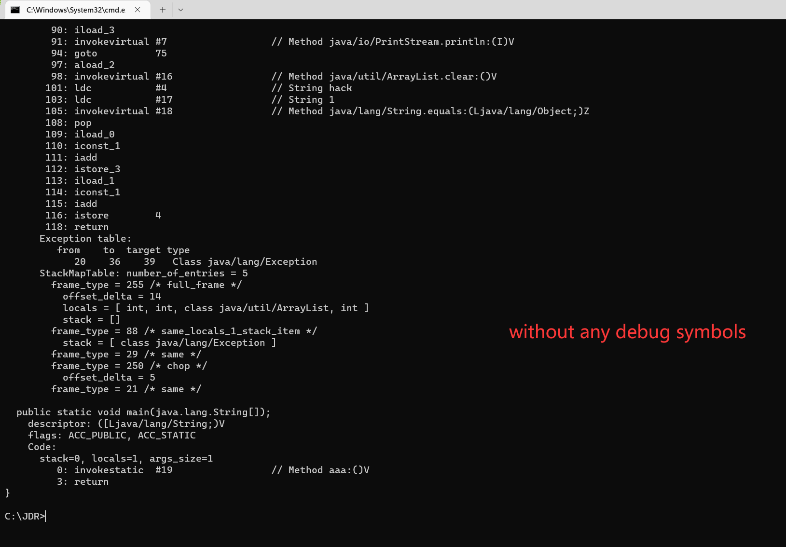
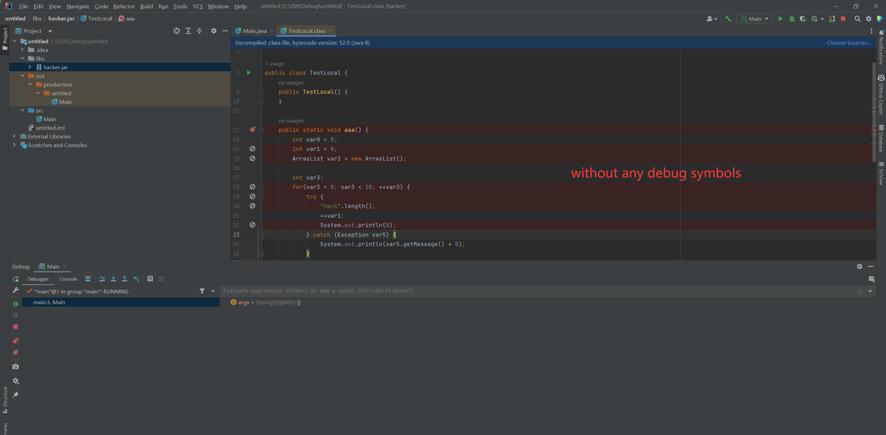
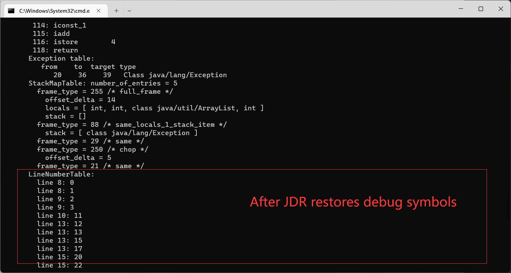
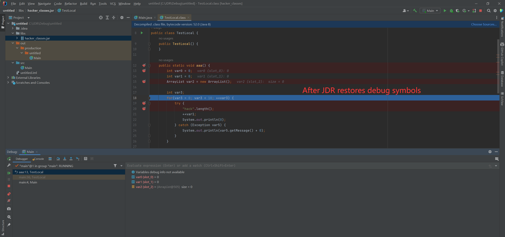

# JDR

JDR is a Java Class symbol recovery tool that can debug applications compiled with "javac -g:none", which is very useful when debugging malware.


Most malicious Java software strips the debug symbols of Class, making it impossible for us to dynamically debug and analyze Java-based malicious programs. When we conduct red team operations, we often conduct code audits on the target WEB programs, and we often encounter missing symbols when debugging the discovered vulnerabilities.


JDR is an excellent debugging symbol recovery tool, which can restore the debugging information of the target Class without any debugging information


# Usage

After restoring the symbols, _source.jar is the decompiled code, you can use ide to import it as the source of debugging source code, _classes.jar is the jar package after restoring debugging, you can directly replace the original jar package

```
Microsoft Windows [Version 10.0.22621.1105]

C:\JDR>java17 -jar JDR.jar
JDR powered by BeichenDream
java -jar jdr.jar rt.jar outdir

C:\JDR>java17 -jar JDR.jar hacker.jar out
JDR powered by BeichenDream
INFO:  Decompiling class TestLocal
INFO:  ... done
INFO:  Decompiling class weaver/mobile/core/MobilePluginLoader
INFO:  ... done
INFO:  Decompiling class weaver/security/classLoader/ClassLoaderManager
INFO:  ... done

C:\JDR>
```

without any debug symbols

The breakpoint cannot be broken and cannot be debugged normally




After JDR restores debug symbols

The breakpoint is broken normally and can be debugged normally





I don’t know why, maybe because IDEA has extra processing for debugging symbols inside IDEA, some codes may not correspond to line numbers in IDEA but can still be debugged, Eclipse does not have this problem

## LICENSE

[Apache License 2.0](/LICENSE) 